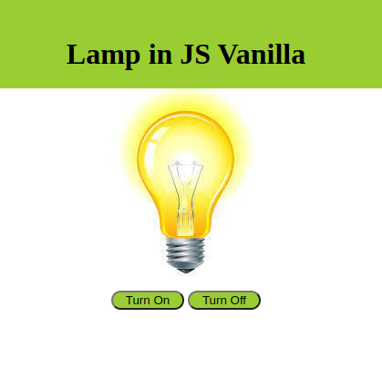

# Lamp with JS

Mini project created with HTML5, CSS3 and Javascript in order to train
programming logic. When you click on turn on the light turns and when
you click on turn off the light turns off.

