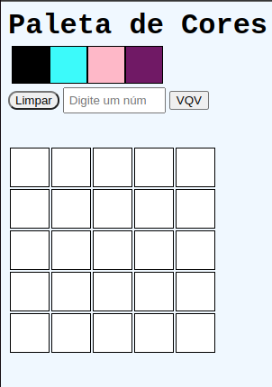

# Pixel Art

Project created with HTML5, CSS3 and Javascript. The colors come randomly
and we can select new ones every time the button is clicked. 
In the input we can add pixel frames so that the screen expands.

